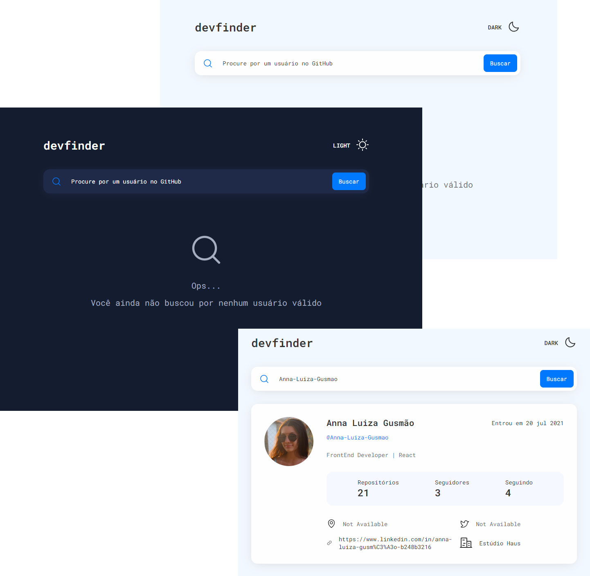

<p align="center">
  
</p>

## 🎉 Let's go!

Para iniciar o projeto insira o comando:
```
npm run dev
```


## 💻 Projeto

Uma aplicação simples para busca de usuários na API do Github que permite a alternância de temas entre Dark e Light. 

Obs.: apenas usuários válidos podem ser encontrados


## 🚀 Tecnologias

Esse projeto foi desenvolvido com as seguintes tecnologias:

- HTML e CSS
- Typescript
- React
- Node e NPM
- Vite


## 📚 Bibliotecas

- Phosphor Icons
- Styled Components
- Date FNS
- Zod
- React Hook Form
- Axios

